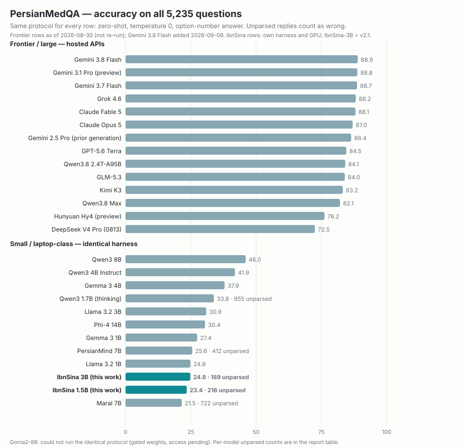

# IbnSina — an open, Persian-first large language model family

Sina Meraji · ORCID 0009-0002-8028-1932 · github.com/sinameraji

[](https://www.apache.org/licenses/LICENSE-2.0) [](https://huggingface.co/ibnsina-llm/ibnsina-1.5b) [](https://ollama.com/ibnsina/ibnsina-1.5b) [](https://huggingface.co/ibnsina-llm/ibnsina-1.5b/tree/main)  [](https://huggingface.co/datasets/ibnsina-llm/synthetic-persian-v1)

**[فارسی: README_FA.md](README_FA.md)**

> [!CAUTION]
> **IbnSina is a small model for writing, summarizing, translating and conversing in Persian — not a source of facts about people, politics, or news.** It is not built for advice, knowledge questions, math, or code — use a large model for those. What it is for: offline Persian text generation on your own device. It can produce fluent but wrong sentences — verify anything that matters.
>
> **ابن‌سینا یک مدل کوچک است برای نوشتن، خلاصه، ترجمه و گفت‌وگو به فارسی — نه منبع اطلاعات درباره‌ی افراد، سیاست یا اخبار.** برای مشاوره، پاسخ به سؤال‌های دانشی، حل ریاضی یا نوشتن کد ساخته نشده است؛ برای آن کارها از مدل‌های بزرگ استفاده کنید. کارش تولید متن فارسی، آفلاین و روی دستگاه خودتان است — و ممکن است جمله‌های روان اما نادرست بسازد؛ هر چیز مهم را خودتان راستی‌آزمایی کنید.

**The first open-source Persian LLM at modern scale pretrained from scratch.** Most Persian models adapt an English-first base (Llama, Mistral); this one never knew English first.




**اولین مدل زبانی فارسی متن‌باز در این مقیاس که از صفر با فارسی آموزش دیده است.** بیشتر مدل‌های فارسی روی یک پایهٔ انگلیسی‌زبان ساخته شده‌اند؛ این مدل هرگز اول انگلیسی یاد نگرفت. وزن‌ها، توکنایزر و دستور ساختِ داده‌ها و آموزش همه منتشر شده‌اند (خودِ پیکره منتشر نمی‌شود) و اولین مدل خانواده، **ibnsina-1.5b**، به‌صورت GGUF روی لپ‌تاپ و گوشی اجرا می‌شود.

IbnSina is a family of open-weight Persian-first large language models trained from scratch, with the full recipe published: corpus pipeline, tokenizer, training stack, supervised-fine-tuning data recipe, evaluation and release tooling. Weights and code are **Apache-2.0**.

| model | params | context | data | status | download |
|---|---:|---:|---|---|---|
| `ibnsina-1.5b` (base + chat) | 1.48 B | 2048 | 46 B tokens (`train_v1_1_open`) + `sft_v2` | released (Aug 2026) | [huggingface.co/ibnsina-llm/ibnsina-1.5b](https://huggingface.co/ibnsina-llm/ibnsina-1.5b) |
| `ibnsina-pilot-360m` | 0.36 B | 2048 | 7.9 B tokens | research pilot, nanochat-native (no GGUF) | GCS bundle, on request |

## Run it

The 2-minute path on any OS is [ollama](https://ollama.com):

**macOS** — install [Ollama for Mac](https://ollama.com/download/mac) (or `brew install ollama`), then in Terminal:
```bash
ollama run hf.co/ibnsina-llm/ibnsina-1.5b
```
**Windows** — install [Ollama for Windows](https://ollama.com/download/windows), then in PowerShell:
```powershell
ollama run hf.co/ibnsina-llm/ibnsina-1.5b
```
**Linux** — `curl -fsSL https://ollama.com/install.sh | sh`, then:
```bash
ollama run hf.co/ibnsina-llm/ibnsina-1.5b
```
That's it — the chat template ships inside the GGUF. Prefer a GUI? [LM Studio](https://lmstudio.ai) (Mac/Windows/Linux): search **ibnsina-llm/ibnsina-1.5b** and click download. Using llama.cpp directly? Grab a GGUF from [the HF repo](https://huggingface.co/ibnsina-llm/ibnsina-1.5b) and:
```bash
# llama.cpp (Metal / CUDA / CPU)
llama-cli -m ibnsina-1.5b-Q4_K_M.gguf
# or register with ollama from the local file
ollama create ibnsina-1.5b -f Modelfile && ollama run ibnsina-1.5b
```

## What's in the box

**Datasets:** [IbnSina Synthetic Persian Corpus v1](https://huggingface.co/datasets/ibnsina-llm/synthetic-persian-v1) — 2.075B tokens of native-Persian synthetic pretraining text (883k judge-filtered documents, Apache-2.0); the full recipe (prompts, judge rubric, calibration suite) lives in [`synth_v1/`](synth_v1/).

- **Corpus pipeline** (`pipeline/`): extraction/normalisation for 39 sources, exact + MinHash dedup (datatrove), a Persian *educational-value* classifier (fastText regressor distilled from 10k Gemini labels on a FineWeb-Edu-style rubric), deterministic mixing with per-source licence gating (`pipeline/licenses.json`). Every build writes a manifest with per-source tokens and licences.
- **Tokenizer** (`training/train_tokenizer.py`): 32,768-token byte-level BPE trained on a Persian-dominant 10 GB sample; v2 uses Llama-3's pre-tokenizer regex so exports need no custom llama.cpp code. On held-out Persian it needs **21–29 % fewer tokens** than Qwen3.5 / Gemma 3 tokenizers (fertility report in `docs/`).
- **Training** (`training/`): [nanochat](https://github.com/karpathy/nanochat)'s training loop (Muon + AdamW, on-the-fly tokenisation, bf16) with a drop-in **Llama-3-shaped model** (`nanochat_patches/nanochat/llama.py`: RMSNorm, RoPE, GQA, SwiGLU, untied head) so checkpoints export to standard GGUF. Spot-GPU tooling: zone-rotating launcher, checkpoint↔GCS sync, automatic resume after preemption, one-file run orchestration.
- **SFT recipe** (`sft_v2/`): a 17-category taxonomy (51.5 k conversations), 136 hand-written gold seeds, two teacher models, a rubric judge with automatic checks (language-ID, repetition, executed tool calls), decontamination against ParsiNLU / PerCoR / TARAZ / Hafez ghazals, and 13 k preference pairs for a later DPO pass. All prompts are in the repo.
- **Evaluation** (`training/nanochat_patches/`): ParsiNLU multiple-choice / entailment / paraphrase in nanochat's categorical format. Results on a public Persian benchmark suite and a technical report will follow the 1.5 B release (see below).
- **Release** (`training/export_gguf.py`, `training/export_release.sh`): GGUF writer (architecture `llama`, GPT-2-style BPE vocab derived from our tokenizer), quantisation, ollama Modelfile, model card.

## Data (train_v1_1_open, 46.35 B tokens)

| slice | share | main sources (licence) |
|---|---:|---|
| Persian web | 63 % | CulturaX-fa (ODC-BY/CC0), mC4-fa (ODC-BY), FineWeb-2-fa (ODC-By) — filtered by the educational-value classifier; news down-weighted |
| English educational | 15 % | FineWeb-Edu (ODC-By), OpenStax (CC-BY), Project Gutenberg / pre-1929 books, peS2o (ODC-By) |
| Code | 10 % | StarCoderData Python + TypeScript (permissive per-file, The Stack v1), Stack Overflow (CC-BY-SA), Persian-NLP GitHub repos (per-repo) |
| Math & textbooks | 5 % | OpenWebMath (ODC-By), Iranian school textbooks from chap.sch.ir (official, no terms page) |
| Persian literature | 0.5 % | Ganjoor classical poetry (public domain; [ganjoor.net](https://ganjoor.net)), fa-Wikisource, a curator-provided history volume |
| Wikipedia | 3 % | fa-Wikipedia ×4 epochs, en-Wikipedia (CC-BY-SA) |
| Parallel fa–en | 2 % | OPUS: OPUS-100, GlobalVoices, HPLT, WikiMatrix, XLEnt, CCMatrix/CCAligned, OpenSubtitles (see licence notes) |

The literature slice was planned at 5 %; only 0.5 % of licence-clean text survived deduplication, and the shortfall was reallocated to Persian web (recorded in the mix manifest). Excluded from the open release on licence grounds: TED2020 (CC-BY-NC-ND), MIZAN and TEP (non-commercial/research), NCERT, Kanoon exam booklets, CodeParrot, Matina (CC-BY-NC-ND), FLORES-200 (eval only). The per-source licence table is `pipeline/licenses.json`; the public mix manifest records the composition at category level. The assembled corpus itself is not redistributed — the pipeline, source list and mix recipe are public so anyone can rebuild it from the original sources.

**Licence policy.** Included: public-domain, permissive and share-alike sources. Curated material without an explicit open licence (official school textbooks, curator-provided volumes) and one research-use parallel corpus (OPUS OpenSubtitles) were admitted per source by curator decision on 2026-08-28 and are recorded as such; NC/ND-licensed sources were excluded. The parallel-data slice includes OPUS OpenSubtitles (research-use terms), retained for training only by curator decision; roughly 0.3 B of 46 B tokens. No source text is redistributed.

## Reproduce

1. Corpus: `pipeline/p0_run.py` (extract/normalise) → `p1_dedup.py` → `p2_quality.py` (label, train, score) → `p3_mix.py --name <mix>`. Phase reports and STOP gates are described in the technical report.
2. Tokenizer: `training/train_tokenizer.py --pattern llama3 --vocab-size 32768`; `training/fertility.py` for the report.
3. Pretraining: apply `training/nanochat_patches/apply_patches.sh` to nanochat @ `92d63d4`, then `NANOCHAT_ARCH=llama train_run.sh <run> --depth=28 --aspect-ratio=73 --head-dim=128 --n-kv-head=4 --ffn-hidden=6144 …` (full args in `training/config_1p5b.md`).
4. SFT: `sft_v2/gen.py` → `judge.py` → `assemble.py`; then `scripts/chat_sft_fa.py`.
5. Eval + export: `scripts/eval_fa.py`, `training/export_release.sh <run> ibnsina-1.5b`.

**Reproducing without the curated material:** run from your own infrastructure — set `CORPUS_BUCKET` (your GCS bucket, `gcloud` authenticated) and `GOOGLE_CLOUD_PROJECT` (Vertex AI, used by the quality classifier and the SFT teacher/judge; `p2_quality.py --no-llm` works without it). Curated and private sources skip cleanly when absent; the build then yields the open subset. Two known gaps, tracked as pre-launch fixes: the generator of `scored/_bands.json` (used by `p3_mix.py`) is not yet in the repo, and `train_tokenizer.py`'s default data path predates the v1.1 mix name — pass your own path.


## Behaviour policy (what the SFT data teaches)

Natural, register-matching Persian; honest uncertainty («نمی‌دانم») instead of invented facts; medical/legal answered as information with a pointer to a professional and emergency numbers where acute; crisis contexts handled warmly and briefly with Iranian helplines. **Respect, symmetrically:** it declines to mock or insult any person or group — leaders, prophets, ethnicities, genders, nationalities, on every side, with one template — while answering factual and theological questions normally, recounting documented history honestly, and mapping contested political questions as "supporters say / critics say" without crowning a side.

## Benchmarks and technical report — coming


A technical report is forthcoming: IbnSina evaluated alongside the 2026 frontier (Claude Opus 5, GPT-5.6, Gemini, Kimi K3, GLM, DeepSeek, Qwen) on Persian exam benchmarks such as [PersianMedQA](https://arxiv.org/abs/2506.00250) — the first such comparison for this model generation. *[link placeholder]* The report will also describe the corpus, tokenizer, training and SFT recipe in full, with a comparison chart against other Persian and multilingual models.

## Limitations

A 1.5 B model trained on 46 B tokens: fluent Persian, weak on precise facts, no memory between conversations, English is a second language. No built-in internet access: it can emit calculator, date-conversion and search *tool calls* in nanochat's format, which work only in a host that executes them — the reference chat runtime in this repo does; llama.cpp and ollama do not. Do not rely on it for medical, legal or financial decisions. Evaluation is early-stage (ParsiNLU). It fabricates confident but false details about real people; do not use it as a source on individuals or current events.

## Acknowledgments

IbnSina stands on community work. Training stack: [nanochat](https://github.com/karpathy/nanochat) by Andrej Karpathy (the origin of this project's training loop, tokenizer tooling and chat scaffolding) and the [Muon](https://github.com/KellerJordan/Muon) optimizer; inference and distribution: [llama.cpp](https://github.com/ggml-org/llama.cpp). Data methods: [datatrove](https://github.com/huggingface/datatrove) (deduplication) and the [FineWeb-Edu](https://huggingface.co/datasets/HuggingFaceFW/fineweb-edu) educational-value rubric, which our Persian classifier adapts; web sources [FineWeb-2](https://huggingface.co/datasets/HuggingFaceFW/fineweb-2), [CulturaX](https://huggingface.co/datasets/uonlp/CulturaX), mC4; [OpenWebMath](https://huggingface.co/datasets/open-web-math/open-web-math), [StarCoderData](https://huggingface.co/datasets/bigcode/starcoderdata), peS2o, OPUS. Persian literature: the [Ganjoor](https://ganjoor.net) project, without which no Persian model would know its poets. Persian NLP we build on or evaluate against: [ParsiNLU](https://github.com/persiannlp/parsinlu), [PerCoR](https://huggingface.co/datasets/MCINext/PerCoR), [TARAZ](https://github.com/Georgetown-IR-Lab/TARAZ), [FarsInstruct](https://huggingface.co/datasets/ParsiAI/FarsInstruct), and the EMNLP 2025 taarof study [*We Politely Insist: Your LLM Must Learn the Persian Art of Taarof*](https://arxiv.org/abs/2509.01035), which shaped our taarof category. Prior Persian LLMs whose work we learned from even as we take the from-scratch route: [PersianMind](https://huggingface.co/universitytehran/PersianMind-v1.0), [Dorna](https://huggingface.co/PartAI/Dorna-Llama3-8B-Instruct), PersianLLaMA, Maral, and the earlier from-scratch [gpt2-fa](https://huggingface.co/HooshvareLab/gpt2-fa) and ParsBERT from HooshvareLab. The pipeline, training runs and evaluations were executed by AI coding agents (Claude Code) under Sina Meraji's direction.

## Licence and citation

Code and weights: Apache-2.0. Training data: per-source licences above; evaluation sets are used only for evaluation (ParsiNLU is CC-BY-NC-SA). Built on nanochat (MIT), datatrove, llama.cpp.

```
@software{ibnsina2026, title={IbnSina: an open Persian-first language model family}, author={Meraji, Sina}, year={2026}, url={https://github.com/ibnsina-llm}, note={ORCID 0009-0002-8028-1932}}
```
