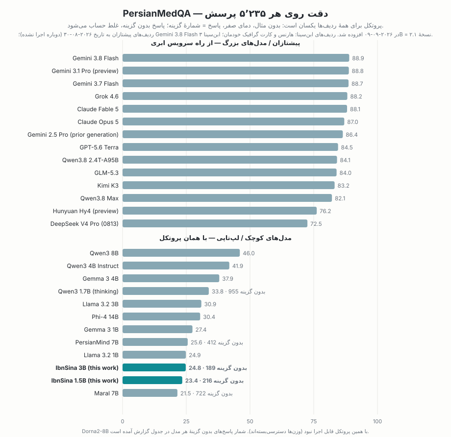

# ابن‌سینا — خانوادهٔ مدل‌های زبانی باز و فارسی‌محور

سینا معراجی · ORCID 0009-0002-8028-1932 · github.com/sinameraji

[](https://www.apache.org/licenses/LICENSE-2.0) [](https://huggingface.co/ibnsina-llm/ibnsina-1.5b) [](https://ollama.com/ibnsina/ibnsina-1.5b) [](https://huggingface.co/ibnsina-llm/ibnsina-1.5b/tree/main)  [](https://huggingface.co/datasets/ibnsina-llm/synthetic-persian-v1)

**[English: README.md](README.md)**

> [!CAUTION]
> **ابن‌سینا یک مدل کوچک است برای نوشتن، خلاصه، ترجمه و گفت‌وگو به فارسی — نه منبع اطلاعات درباره‌ی افراد، سیاست یا اخبار.** برای مشاوره، پاسخ به سؤال‌های دانشی، حل ریاضی یا نوشتن کد ساخته نشده است؛ برای آن کارها از مدل‌های بزرگ استفاده کنید. کارش تولید متن فارسی، آفلاین و روی دستگاه خودتان است — و ممکن است جمله‌های روان اما نادرست بسازد؛ هر چیز مهم را خودتان راستی‌آزمایی کنید.
>
> **IbnSina is a small model for writing, summarizing, translating and conversing in Persian — not a source of facts about people, politics, or news.** It is not built for advice, knowledge questions, math, or code — use a large model for those. What it is for: offline Persian text generation on your own device. It can produce fluent but wrong sentences — verify anything that matters.

**ابن‌سینا اولین مدل زبانی متن‌باز فارسی در این مقیاس است که از صفر و با محوریت فارسی آموزش دیده.** مدل‌های فارسی تا امروز تقریباً همیشه روی یک مدل انگلیسیِ آماده (Llama، Mistral و مانند این‌ها) ساخته شده‌اند و فارسی را بعداً، مثل زبان دوم، یاد گرفته‌اند. ابن‌سینا از روز اول با فارسی بزرگ شده است. نامش را هم از ابوعلی سینا گرفته.




این پروژه فقط انتشار وزن مدل نیست؛ کل دستور پختش باز است: پایپ‌لاین ساخت پیکره، توکنایزر، کد آموزش، دستور دادهٔ SFT، ارزیابی و ابزارهای انتشار. کد و وزن‌ها زیر مجوز **Apache-2.0** منتشر می‌شوند.

| مدل | پارامتر | بافتار | داده | وضعیت | دانلود |
|---|---:|---:|---|---|---|
| `ibnsina-1.5b` (پایه + گفت‌وگو) | ۱٫۴۸ میلیارد | ۲۰۴۸ | ۴۶ میلیارد توکن (`train_v1_1_open`) + `sft_v2` | منتشرشده (شهریور ۱۴۰۵) | [huggingface.co/ibnsina-llm/ibnsina-1.5b](https://huggingface.co/ibnsina-llm/ibnsina-1.5b) |
| `ibnsina-pilot-360m` | ۰٫۳۶ میلیارد | ۲۰۴۸ | ۷٫۹ میلیارد توکن | پایلوت پژوهشی، بومیِ nanochat (بدون GGUF) | در صورت درخواست |

## اجرای مدل

ساده‌ترین راه در هر سیستم‌عاملی [ollama](https://ollama.com) است — دو دقیقه بیشتر وقت نمی‌گیرد:

**مک** — [Ollama برای مک](https://ollama.com/download/mac) را نصب کنید (یا `brew install ollama`)، بعد در ترمینال:
```bash
ollama run hf.co/ibnsina-llm/ibnsina-1.5b
```
**ویندوز** — [Ollama برای ویندوز](https://ollama.com/download/windows) را نصب کنید، بعد در PowerShell همان دستور بالا را بزنید.

**لینوکس** — اول `curl -fsSL https://ollama.com/install.sh | sh` و بعد همان دستور.

همین! قالب گفت‌وگو داخل خود فایل GGUF است. رابط گرافیکی می‌خواهید؟ [LM Studio](https://lmstudio.ai) را نصب کنید و **ibnsina-llm/ibnsina-1.5b** را جست‌وجو و دانلود کنید. با llama.cpp هم می‌شود: فایل GGUF را از [مخزن HF](https://huggingface.co/ibnsina-llm/ibnsina-1.5b) بگیرید و:
```bash
llama-cli -m ibnsina-1.5b-Q4_K_M.gguf
```

## چه چیزهایی در این مخزن است

**داده‌ها:** [پیکرهٔ مصنوعی فارسی ابن‌سینا نسخهٔ ۱](https://huggingface.co/datasets/ibnsina-llm/synthetic-persian-v1) — ۲٫۰۷۵ میلیارد توکن متن آموزشی مصنوعیِ فارسی (۸۸۳ هزار سندِ داورگزیده، Apache-2.0)؛ دستور ساخت کامل در [`synth_v1/`](synth_v1/).

- **پایپ‌لاین پیکره** (`pipeline/`): استخراج و نرمال‌سازی برای ۳۹ منبع، حذف تکرارِ دقیق و MinHash (با datatrove)، یک دسته‌بندِ «ارزش آموزشی» مخصوص فارسی (رگرسور fastText که از ۱۰ هزار برچسب Gemini با روبریکی به سبک FineWeb-Edu تقطیر شده) و ترکیب قطعیِ داده‌ها با فیلتر مجوز برای تک‌تک منابع (`pipeline/licenses.json`). هر بار ساخت پیکره، مانیفستی نوشته می‌شود که سهم توکن و مجوز هر منبع در آن ثبت است.
- **توکنایزر** (`training/train_tokenizer.py`): BPE بایت‌سطح با ۳۲٬۷۶۸ توکن که روی یک نمونهٔ ۱۰ گیگابایتیِ عمدتاً فارسی آموزش دیده. نسخهٔ دومش از regex پیش‌توکن‌سازی Llama-3 استفاده می‌کند تا GGUF خروجی بدون هیچ کد سفارشی در llama.cpp کار کند. روی متن فارسیِ دیده‌نشده **۲۱ تا ۲۹ درصد توکن کمتر** از توکنایزرهای Qwen3.5 و Gemma 3 مصرف می‌کند (گزارش کامل در `docs/`).
- **آموزش** (`training/`): حلقهٔ آموزش [nanochat](https://github.com/karpathy/nanochat) (بهینه‌ساز Muon + AdamW، توکن‌سازی حین اجرا، bf16) به‌علاوهٔ یک **مدل هم‌شکل Llama-3** که جایگزین معماری پیش‌فرض می‌شود (`nanochat_patches/nanochat/llama.py`: RMSNorm، RoPE، GQA، SwiGLU، لایهٔ خروجی جدا از امبدینگ) تا چک‌پوینت‌ها مستقیم به GGUF استاندارد تبدیل شوند. ابزار کار با GPUهای اسپات هم داخل مخزن است: راه‌انداز با چرخش بین زون‌ها، همگام‌سازی چک‌پوینت‌ها با فضای ابری، ازسرگیری خودکار بعد از قطع شدن ماشین، و اجرای کل مسیر با یک فایل.
- **دستور SFT** (`sft_v2/`): تاکسونومی ۱۷ دسته‌ای با ۵۱٫۵ هزار گفت‌وگو، ۱۳۶ نمونهٔ طلاییِ دست‌نویس، دو مدل معلم، داورِ روبریک‌محور همراه با بررسی‌های خودکار (تشخیص زبان، تکرار، اجرای واقعی فراخوانی‌های ابزار)، پاک‌سازی در برابر مجموعه‌های ارزیابی (ParsiNLU، PerCoR، TARAZ، غزل‌های حافظ) و ۱۳ هزار جفت ترجیحی برای مرحلهٔ DPO بعدی. همهٔ پرامپت‌ها داخل مخزن‌اند.
- **ارزیابی** (`training/nanochat_patches/`): سؤال‌های چندگزینه‌ای، استلزام و بازنویسی از ParsiNLU در قالب categorical خود nanochat. نتایج روی یک مجموعه‌آزمون عمومی فارسی به‌همراه گزارش فنی، بعد از انتشار مدل ۱٫۵B می‌آید (پایین‌تر ببینید).
- **انتشار** (`training/export_gguf.py`، `training/export_release.sh`): نوشتن GGUF (معماری `llama`، واژگان BPE به سبک GPT-2 ساخته‌شده از توکنایزر خودمان)، کوانتیزه‌سازی، Modelfile برای ollama و کارت مدل.

## دادهٔ آموزش (train_v1_1_open — ۴۶٫۳۵ میلیارد توکن)

| بخش | سهم | منابع اصلی (مجوز) |
|---|---:|---|
| وب فارسی | ۶۳٪ | CulturaX-fa (ODC-BY/CC0)، mC4-fa (ODC-BY)، FineWeb-2-fa (ODC-By) — پالایش با دسته‌بند ارزش آموزشی؛ وزن اخبار کم شده |
| آموزشی انگلیسی | ۱۵٪ | FineWeb-Edu (ODC-By)، OpenStax (CC-BY)، کتاب‌های Project Gutenberg / پیش از ۱۹۲۹، peS2o (ODC-By) |
| کد | ۱۰٪ | StarCoderData پایتون و TypeScript (مجوزهای آزاد فایل‌به‌فایل، The Stack v1)، Stack Overflow (CC-BY-SA)، مخزن‌های GitHub پردازش زبان فارسی (مجوز هر مخزن) |
| ریاضی و کتاب درسی | ۵٪ | OpenWebMath (ODC-By)، کتاب‌های درسی رسمی ایران از chap.sch.ir |
| ادبیات فارسی | ۰٫۵٪ | شعر کلاسیک از [گنجور](https://ganjoor.net) (مالکیت عمومی)، ویکی‌نبشتهٔ فارسی، یک جلد تاریخ فراهم‌شده توسط گردآورنده |
| ویکی‌پدیا | ۳٪ | ویکی‌پدیای فارسی ×۴ دور، ویکی‌پدیای انگلیسی (CC-BY-SA) |
| موازی فارسی–انگلیسی | ۲٪ | OPUS: OPUS-100، GlobalVoices، HPLT، WikiMatrix، XLEnt، CCMatrix/CCAligned، OpenSubtitles (یادداشت مجوزها را ببینید) |

قرار بود سهم ادبیات ۵٪ باشد؛ اما بعد از حذف تکرار، از متن‌های دارای مجوزِ پاک فقط ۰٫۵٪ باقی ماند و کسری‌اش به وب فارسی منتقل شد (در مانیفست ترکیب ثبت است). این منابع هم به دلیل مجوز از نسخهٔ باز کنار گذاشته شدند: TED2020 (CC-BY-NC-ND)، MIZAN و TEP (فقط پژوهشی/غیرتجاری)، NCERT، دفترچه‌های کنکور کانون، CodeParrot، Matina (CC-BY-NC-ND) و FLORES-200 (فقط برای ارزیابی). فهرست مجوزِ منبع‌به‌منبع در `pipeline/licenses.json` است و مانیفستِ ترکیبِ عمومی، ترکیب را در سطح دسته‌بندی ثبت می‌کند. خودِ پیکرهٔ نهایی جایی منتشر نمی‌شود — پایپ‌لاین، فهرست منابع و دستور ترکیب عمومی‌اند تا هر کس بخواهد، بتواند همان پیکره را از منابع اصلی خودش بسازد.

**سیاست مجوز.** آنچه وارد شده: منابع مالکیت عمومی، مجوزهای آزاد و مجوزهای اشتراک‌مشابه. مطالب گردآوری‌شده‌ای که مجوز باز صریحی ندارند (کتاب‌های درسی رسمی و مجلدهای فراهم‌شده توسط گردآورنده) و یک پیکرهٔ موازی با شرط استفادهٔ پژوهشی (OPUS OpenSubtitles) با تصمیم گردآورنده در تاریخ ۶ شهریور ۱۴۰۵ (۲۰۲۶-۰۸-۲۸) منبع‌به‌منبع پذیرفته و به همین صورت ثبت شده‌اند؛ منابع دارای مجوز NC/ND کنار گذاشته شدند. سهم OpenSubtitles حدود ۰٫۳ میلیارد توکن از ۴۶ میلیارد است و فقط در آموزش به کار رفته. متن هیچ منبعی بازنشر نمی‌شود.

## بازتولید کامل

۱. پیکره: `pipeline/p0_run.py` (استخراج/نرمال‌سازی) ← `p1_dedup.py` ← `p2_quality.py` (برچسب، آموزش، امتیاز) ← `p3_mix.py --name <mix>`. گزارش هر مرحله و دروازه‌های توقف در گزارش فنی آمده است.
۲. توکنایزر: `training/train_tokenizer.py --pattern llama3 --vocab-size 32768`؛ گزارش بهره‌وری توکنایزر (fertility) با `training/fertility.py`.
۳. پیش‌آموزش: `training/nanochat_patches/apply_patches.sh` را روی nanochat در کامیت `92d63d4` اعمال کنید، سپس `NANOCHAT_ARCH=llama train_run.sh <run> --depth=28 --aspect-ratio=73 --head-dim=128 --n-kv-head=4 --ffn-hidden=6144 …` (آرگومان‌های کامل در `training/config_1p5b.md`).
۴. تنظیم دقیق: `sft_v2/gen.py` ← `judge.py` ← `assemble.py`؛ سپس `scripts/chat_sft_fa.py`.
۵. ارزیابی و انتشار: `scripts/eval_fa.py`، `training/export_release.sh <run> ibnsina-1.5b`.

**بازتولید بدون مواد گردآوری‌شده:** روی زیرساخت خودتان اجرا کنید — باکت GCS خود را با `CORPUS_BUCKET` و پروژهٔ GCP خود را با `GOOGLE_CLOUD_PROJECT` بدهید (برای دسته‌بند کیفیت و معلم/داور SFT به Vertex AI نیاز است؛ `p2_quality.py --no-llm` بدون آن هم اجرا می‌شود). منابع گردآوری‌شده اگر روی دیسک نباشند بی‌خطا رد می‌شوند و خروجی، زیرمجموعهٔ باز خواهد بود. دو نکتهٔ در دست رفع: تولیدکنندهٔ فایل `scored/_bands.json` (که `p3_mix.py` می‌خواند) هنوز در مخزن نیست، و مسیر پیش‌فرض اسکریپت توکنایزر مال ترکیب v1 است — مسیر خودتان را بدهید.


## رفتار مدل (آنچه دادهٔ SFT یاد می‌دهد)

فارسیِ طبیعی که لحنش را با کاربر هماهنگ می‌کند؛ وقتی نمی‌داند، می‌گوید «نمی‌دانم» و جواب از خودش نمی‌سازد؛ سؤال‌های پزشکی و حقوقی را در حد اطلاعات عمومی پاسخ می‌دهد، به متخصص ارجاع می‌دهد و در موارد حاد شماره‌های اورژانس را می‌آورد؛ با موقعیت‌های بحرانی کوتاه و باملاحظه برخورد می‌کند و خطوط امداد ایران را معرفی می‌کند. **احترام متقارن:** تمسخر و توهین به هیچ فرد یا گروهی را نمی‌پذیرد — رهبران، پیامبران، اقوام، جنسیت‌ها و ملیت‌ها، از هر طرف که باشد، با یک معیار واحد — اما به پرسش‌های واقعی و بحث‌های عادی الهیاتی جواب می‌دهد، تاریخ مستند را همان‌طور که هست روایت می‌کند و در موضوع‌های سیاسیِ مورد اختلاف، حرف موافقان و منتقدان را کنار هم می‌گذارد بی‌آنکه خودش داوری کند.

## ارزیابی و گزارش فنی — به‌زودی


گزارش فنی در راه است: مقایسهٔ ابن‌سینا با مدل‌های پیشتاز ۲۰۲۶ (Claude Opus 5، GPT-5.6، Gemini، Kimi K3، GLM، DeepSeek، Qwen) روی آزمون‌های فارسی مثل [PersianMedQA](https://arxiv.org/abs/2506.00250) — اولین مقایسه‌ای از این دست برای این نسل از مدل‌ها. *[جای پیوند]* در همان گزارش، پیکره، توکنایزر، روند آموزش و دستور SFT هم به‌تفصیل آمده است، همراه با نمودار مقایسه با دیگر مدل‌های فارسی و چندزبانه.

## محدودیت‌ها

ابن‌سینا مدلی ۱٫۵ میلیارد پارامتری است که ۴۶ میلیارد توکن دیده — این را باید جدی گرفت. فارسی‌اش روان است، اما روی جزئیات واقعی (تاریخ‌ها، آمارها، اسم‌ها) لغزش دارد؛ بین گفت‌وگوها حافظه‌ای ندارد و انگلیسی زبان دومش است. به اینترنت هم وصل نیست. می‌تواند فراخوانی ابزار (ماشین‌حساب، تبدیل تاریخ، جست‌وجو) را در قالب nanochat تولید کند، ولی این فراخوانی‌ها فقط وقتی کار می‌کنند که میزبان اجرایشان کند — سرور مرجعِ همین مخزن این کار را می‌کند؛ llama.cpp و ollama نه. برای تصمیم‌های پزشکی، حقوقی یا مالی به آن تکیه نکنید. ارزیابی‌ها هم هنوز اول راه‌اند (ParsiNLU). دربارهٔ افراد واقعی جزئیات نادرست اما با‌اطمینان می‌سازد؛ به‌عنوان منبع دربارهٔ اشخاص یا رویدادهای روز به آن تکیه نکنید.

## مجوز و استناد

کد و وزن‌ها: Apache-2.0. دادهٔ آموزش: مجوز هر منبع در جدول بالا آمده؛ مجموعه‌های ارزیابی فقط برای ارزیابی به کار رفته‌اند (ParsiNLU با مجوز CC-BY-NC-SA).

```
@software{ibnsina2026, title={IbnSina: an open Persian-first language model family}, author={Meraji, Sina}, year={2026}, url={https://github.com/ibnsina-llm}, note={ORCID 0009-0002-8028-1932}}
```

## قدردانی

ابن‌سینا بدون کار جامعهٔ متن‌باز وجود نداشت. سامانهٔ آموزش از [nanochat](https://github.com/karpathy/nanochat) آندره کارپاتی می‌آید — حلقهٔ آموزش، ابزار توکنایزر و داربست گفت‌وگوی این پروژه از همان‌جاست — به‌همراه بهینه‌ساز [Muon](https://github.com/KellerJordan/Muon)؛ اجرا و توزیع هم با [llama.cpp](https://github.com/ggml-org/llama.cpp). در سمت داده: [datatrove](https://github.com/huggingface/datatrove) برای حذف تکرار و روبریک ارزش آموزشی [FineWeb-Edu](https://huggingface.co/datasets/HuggingFaceFW/fineweb-edu) که دسته‌بند فارسی ما از آن اقتباس شده؛ منابع وب [FineWeb-2](https://huggingface.co/datasets/HuggingFaceFW/fineweb-2)، [CulturaX](https://huggingface.co/datasets/uonlp/CulturaX) و mC4؛ و [OpenWebMath](https://huggingface.co/datasets/open-web-math/open-web-math)، [StarCoderData](https://huggingface.co/datasets/bigcode/starcoderdata)، peS2o و OPUS. برای ادبیات فارسی وام‌دار پروژهٔ [گنجور](https://ganjoor.net) هستیم — بی گنجور، هیچ مدل فارسی‌ای شاعرانش را نمی‌شناخت. از پژوهش‌های پردازش زبان فارسی که بر آن‌ها بنا کرده‌ایم یا با آن‌ها می‌سنجیم: [ParsiNLU](https://github.com/persiannlp/parsinlu)، [PerCoR](https://huggingface.co/datasets/MCINext/PerCoR)، [TARAZ](https://github.com/Georgetown-IR-Lab/TARAZ)، [FarsInstruct](https://huggingface.co/datasets/ParsiAI/FarsInstruct) و مقالهٔ EMNLP 2025 دربارهٔ تعارف، [*We Politely Insist: Your LLM Must Learn the Persian Art of Taarof*](https://arxiv.org/abs/2509.01035)، که دستهٔ تعارف ما را شکل داد. و از مدل‌های فارسی پیش از خودمان که از کارشان آموختیم، هرچند راه «از صفر» را رفتیم: [PersianMind](https://huggingface.co/universitytehran/PersianMind-v1.0)، [Dorna](https://huggingface.co/PartAI/Dorna-Llama3-8B-Instruct)، PersianLLaMA، Maral، و [gpt2-fa](https://huggingface.co/HooshvareLab/gpt2-fa) و ParsBERT از HooshvareLab. پایپ‌لاین، اجرای آموزش‌ها و ارزیابی‌ها را ایجنت‌های کدنویسی هوش مصنوعی (Claude Code) زیر نظر سینا معراجی انجام داده‌اند.
